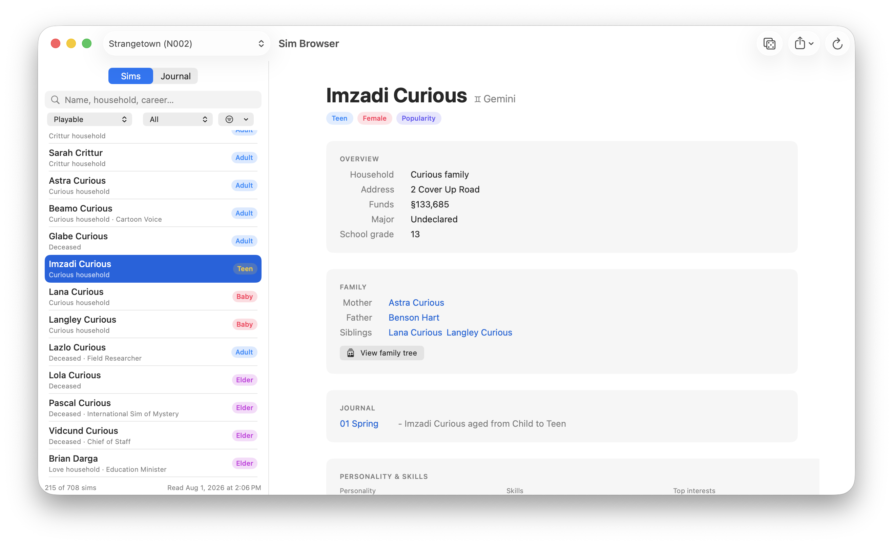
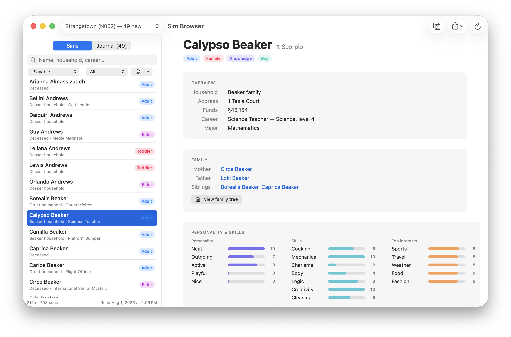
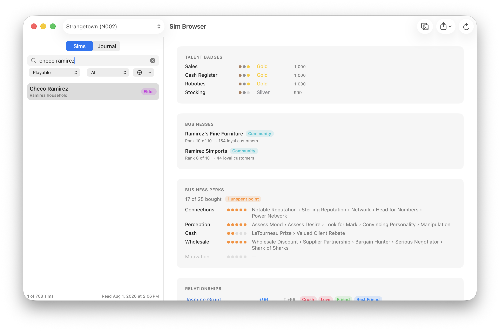
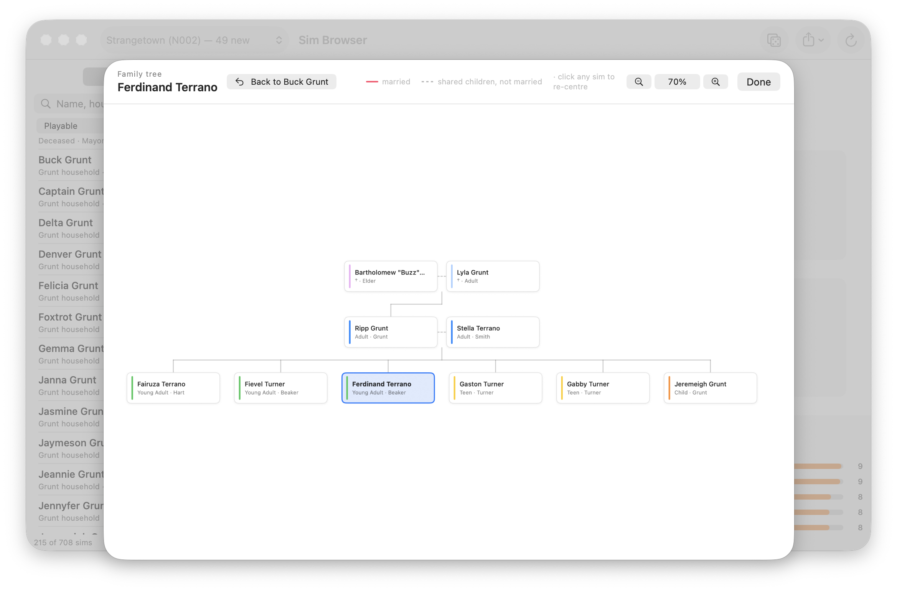
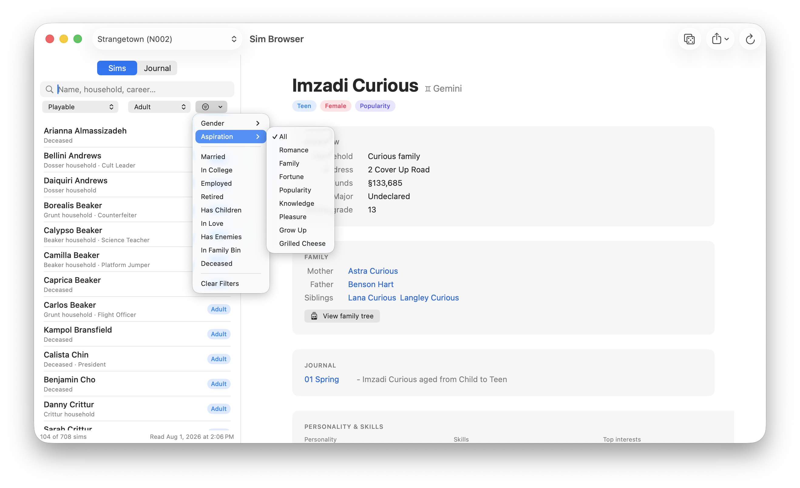
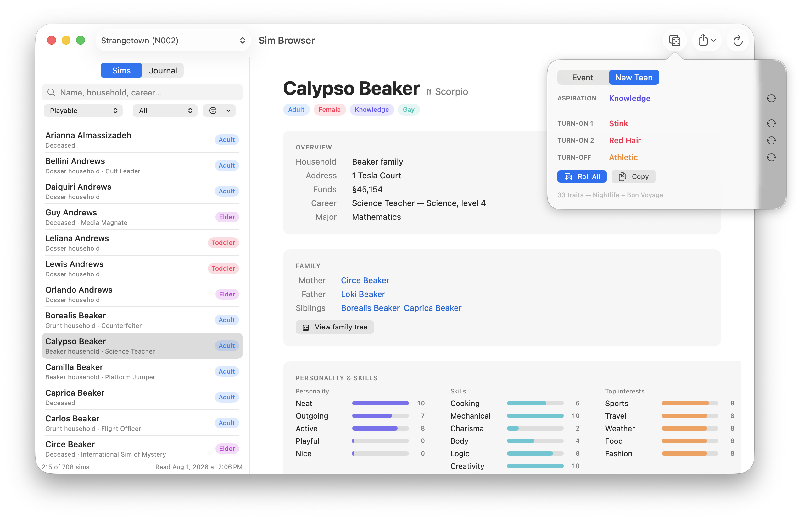
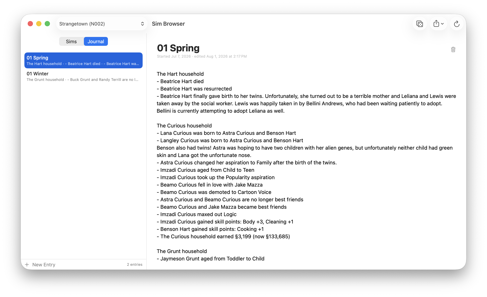
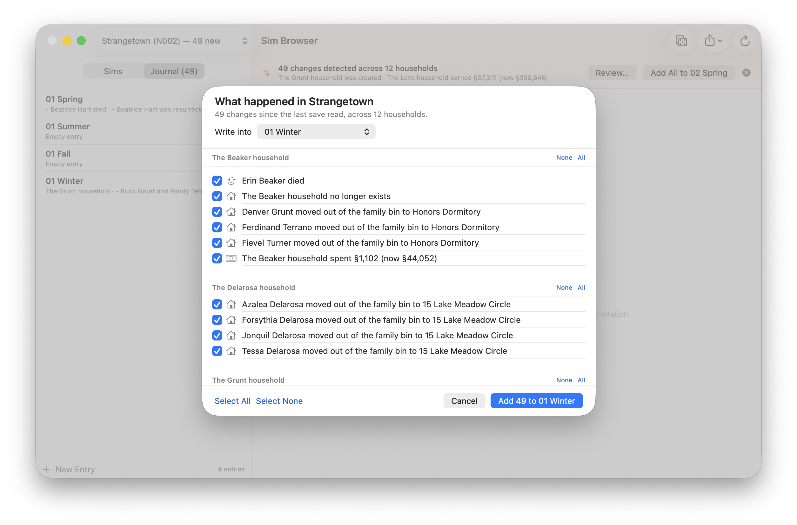

# Sim Browser & sims2parser

A native macOS browser for **The Sims 2** save files — look up any sim and see
their family, address, career, university major, relationships, and life story,
SimPE-style but Mac-native — plus the Python toolkit that parses the game's
DBPF `.package` format underneath it.

Built for the Aspyr **Super Collection** on macOS. Strictly **read-only**: the
app never writes a single byte to your saves.



## The app

**Sim Browser** reads every neighborhood in your save folder and gives you:

- **Every sim, one click away** — name, bio, age, zodiac, aspiration,
  orientation, household + address + family funds, career with the real
  in-game job title ("State Assemblyperson", not "Politics 6"), retired
  career, and university major with semester.
- **Family & relationships** — parents, spouse, siblings, and children as
  clickable links, plus every meaningful relationship with daily/lifetime
  scores and flags (love, married, best friends, enemies, BFF).
- **Family tree** — an hourglass chart five generations tall: grandparents,
  parents, the sim with their siblings and spouses, children, grandchildren.
  Couples are joined solid pink when the save records a marriage and dashed
  when they only share children (divorced, widowed, or abducted by aliens —
  hello, Bella). Click any box to re-centre the tree on that sim, which walks
  the whole hood one relative at a time.
- **Personality, skills, and interests** as SimPE-style meters.
- **Talent badges** — every badge a sim has made progress on, strongest first,
  with Bronze/Silver/Gold pips and the raw points. Progress below the first
  threshold at 333 shows as *In progress* rather than as no badge at all, and
  points aren't capped at Gold — the game keeps counting.
- **Businesses** — what the sim's household owns, best-ranked first, each
  marked Home or Community with its rank and customer loyalty. A business
  owned by a relative names them and links through. Where the neighborhood has
  no rank to give — a home business, or a lot bought but never opened — the
  row says which of the two it is rather than showing a blank.
- **Business perks** — the Open for Business reward tracks a sim has spent on,
  each of the five shown to its five tiers, filled pips for what's bought and
  the perks named in the order they were bought, plus any unspent points. Only
  a handful of sims in a hood own any, so the panel appears only for those who
  do — including a sim sitting on points with nothing bought yet.
- **Life-state awareness** — Young Adults at university, unplaced sims in the
  Family Bin, and the dearly departed (deaths are detected from ghost flags)
  each get their own badge and filter.
- **Search and stackable filters** — playable/townie, age stage, gender,
  aspiration, married, in college, employed, retired, has children, in love,
  has enemies, owns a business, has business perks, has talent badges,
  deceased.
- **CSV export** — entire neighborhood, the currently filtered list, or just
  the selected sims, in a spreadsheet-friendly column layout.
- **Randomizer** (the dice in the toolbar) — two rollers. *Event* draws a
  gameplay prompt from your planning spreadsheet, falling back to a built-in
  list. *New Teen* rolls what the game asks for when a child grows up: one of
  the six Aspirations, two Turn Ons and a Turn Off, never repeating a trait
  across the three slots. Each slot has its own re-roll so you can keep the
  parts you like. The 33 traits are transcribed from the printed guides —
  19 from Nightlife ch. 4, 14 more from Bon Voyage ch. 1 — not from memory.

### The sim page



Everything the save knows about one sim on a single page. The career line is
the real in-game rank — "Science Teacher — Science, level 4", not "Science 4" —
resolved through `careers.json`, and parents, siblings, and spouses are links,
so walking a bloodline is a series of clicks.

### Badges, businesses, and perks



Further down the same page, for a sim who has been playing Open for Business
properly. Three details this shows that the panels were built around:

- **Stocking sits at 999** — one point short of Gold, and the number is there to
  say so. Badges are scored, not just tiered, and the score keeps climbing past
  1,000 once Gold is reached.
- **Rank 10 of 10, 154 loyal customers** on Ramirez's Fine Furniture. Rank and
  loyalty come from a household token the game only writes for a business run
  away from home, which is why a home business shows an owner but no rank.
- **Motivation is empty and shown anyway**, greyed with an em dash. The save
  only records tracks a sim has spent in, so an untouched track is absent from
  the data — drawing all five is what makes "17 of 25 bought" legible as
  progress rather than a bare number.

### Family tree



Strangetown's Grunt–Terrano line, centred on Ferdinand. Both couples here are
joined by a **dashed** line rather than solid pink — the save ties them together
through shared children with no current marriage on record, which is equally how
a divorced or widowed pair comes out (Buzz and Lyla are both dead, marked †).
Click any box to re-centre the tree on that sim and keep walking.

### Search and filters



Filters stack rather than replace, and the counter at the bottom keeps score —
here Playable + Adult has cut 708 sims down to 104, with Aspiration about to
narrow it further.

Every trait filter is three-way: leave it alone, require it, or **exclude** it.
So "Deceased" also gives you *Living*, "Married" also gives you *Not Married*,
and a question like *playable Adults with the Romance aspiration who are alive
and unmarried* is one pass through the menu. The traits are grouped —
Household, Career, Social, Business — and the status bar spells out what is in
force, because a badge counting "5 filters" can't tell you which way any of
them points.

### Randomizer



A *New Teen* roll: one aspiration, two Turn Ons, one Turn Off, guaranteed
distinct. Each row re-rolls on its own, so you can keep Knowledge and spin the
traits again.

### The journal

A per-neighborhood play journal with one entry per season ("01 Spring",
"01 Summer", … — the next season name is suggested automatically).



The killer feature: hit **⌘R** after a play session and the app **diffs your
saves against the last read** and drafts the entry for you. What it catches:

| | |
|---|---|
| **Life stages** | births (with both parents named), age-ups, deaths, adoptions |
| **Romance** | marriages, engagements and called-off engagements, going steady, new crushes, falling in and out of love, divorces |
| **Career** | first jobs, promotions, demotions, career changes, retirements |
| **University** | leaving for college, semesters, declared majors, graduating, coming home |
| **Skills** | points gained per skill, and maxing one out |
| **Social** | new and lost best friends, new feuds, and enemies patching things up |
| **Household** | moving lot, moving in together, family-bin moves, new and dissolved households, money earned or spent |
| **Other** | aspirations taken up, personality shifts, noticeable weight changes |

Because rotational play goes household by household, the draft is **grouped by
family** rather than dumped as one flat list, biggest events first:

```
The Goth household
- Cassandra Goth got engaged to Don Lothario
- Mortimer Goth was promoted to Chief Executive Officer
- Alexander Goth gained skill points: Logic +3, Cleaning +1

The Pleasant household
- Daniel Pleasant and Mary-Sue Pleasant called off their engagement
- The Pleasant household earned §14,200 (now §51,908)
```

**Review…** opens a checklist of everything found, grouped the same way, so a
season's real story goes in and the noise stays out; **Add All** skips the
checklist. Anything left unticked stays pending for next time. Both the Journal
tab and the neighborhood menu show a count of what is waiting, so a hood you
haven't rotated to yet still announces itself.



Forty-nine changes across twelve households, grouped by family with a per-household
**None**/**All**, and a picker for which season's entry they land in.

Reciprocal events are reported once, not twice — a marriage is one line, not
one per spouse — and a whole household relocating is one line rather than one
per member. Any sim mentioned by name in an entry gets a **Journal** section on
their detail page linking back to every season they appear in: write hood-wide,
read per-sim.

## Install & run

```sh
git clone https://github.com/GingerScripting/sims2parser.git
cd sims2parser
./SimBrowser/make_app.sh     # builds "Sim Browser.app" in the repo root
open "Sim Browser.app"
```

Requirements: macOS 13+, Xcode command-line tools (for `swift build`),
Python 3.9+ (system Python is fine), and The Sims 2 Super Collection with at
least one saved neighborhood.

The build is universal (arm64 + x86_64) and self-contained: `make_app.sh` copies
the extractor and everything it imports into `Contents/Resources`, so the
finished `.app` can be moved anywhere — `/Applications`, a `.dmg`, a `.pkg`
payload — without needing the repo it was built from. Two knobs, both optional:

```sh
ARCHS=native ./SimBrowser/make_app.sh    # this machine only, quicker to iterate
SIGN_ID="Developer ID Application: …" ./SimBrowser/make_app.sh
```

Without `SIGN_ID` the app is ad-hoc signed, which runs locally but will be
stopped by Gatekeeper if anyone downloads it. Signing happens after the payload
is staged, so `Contents/Resources` is covered by the seal.

First launch reads your neighborhoods automatically (a few seconds). **⌘R**
re-reads them any time. Data is cached in
`~/Library/Application Support/SimBrowser/`.

## How it works

```
Sims 2 saves ──▶ s2parser.py ──▶ s2neighborhood.py ──▶ sims.json ──▶ SwiftUI app
(DBPF/QFS)       (container)     (SDSC, FAMI, LTXT,     (cache)      (SimBrowser/)
                                  FAMt, SREL, CTSS)
```

All file-format work happens in Python; the Swift app only ever reads the
extracted JSON. That split keeps the save-file logic in one place (and keeps
the app trivially incapable of corrupting a save).

| File | What it does |
|------|--------------|
| `s2parser.py` | DBPF container + QFS/RefPack **compression and decompression** + BHAV (SimAntics) decompiler. Also a CLI: `python3 s2parser.py --bhav file.package` |
| `s2neighborhood.py` | Turns a neighborhood's packages into JSON: sims, households, lots, family ties, relationships, businesses. `python3 s2neighborhood.py --out sims.json` |
| `s2ngbh.py` | The neighborhood token store (NGBH): owned businesses with their rank, and every sim's talent badges |
| `s2luastate.py` | Per-sim Lua state tables (`0x3053CF74`): Open for Business perks and unspent perk points, and Pets learned behaviors |
| `s2savediff.py` | Snapshots a save and diffs two snapshots by package, resource, and byte — the "where does the game keep X?" tool. `python3 s2savediff.py snap before` / `diff before after --minus …` |
| `s2doctor.py` | Freeze/glitch diagnostic — reads the game's own error logs, scans Downloads for damaged packages and overlapping overrides, and cross-references the two. `python3 s2doctor.py` |
| `careers.json` | Career/major GUID → name and per-level job titles, harvested from the game's own `objects.package` files (base + every EP) |
| `s2writer.py` | DBPF *writer* — emits v1.1 / index 7.2 packages, stored or QFS-compressed with a matching DIR, plus `read_all_resources()` for read-modify-write editing |
| `s2object.py` | Object resource **parsers and builders** — STR#/TTAs/CTSS, TTAB (v0x4F and v0x54), OBJf, OBJD, and a BHAV assembler. Every parser round-trips byte-for-byte against the donors in `sample-packages/`: `python3 s2object.py` |
| `s2clone.py` | **Object cloning** — the SimPE Object Workshop step. Gives a donor object a new GUID and rewrites every reference that pointed at the old one, including GUID literals buried in BHAV operands. `python3 s2clone.py donor.package new.package --name "My Thing"` |
| `SimBrowser/` | The SwiftUI app ([its own README](SimBrowser/README.md)) |
| `sim_browser.py` | Legacy tkinter prototype — superseded by the app |

### Reverse-engineering notes

The neighborhood formats (SDSC sim descriptions, FAMI households, LTXT lot
text, FAMt family ties, SREL relationships) were decoded against
[SimsWiki](https://simswiki.info/wiki.php?title=SDSC) documentation and
verified empirically against canonical premades — if the parser can't tell
you that Daniel Pleasant loves Mary-Sue while she's at −59 and falling, it
isn't parsing Pleasantview correctly. Two hard-won details for fellow
travelers:

- Character-file slot numbers are **not** neighborhood sim ids; join
  character packages to SDSC records via the OBJD GUID at `0x5C` ↔ SDSC GUID
  at `0x1A6`.
- Sim **names are not unique** — every hood here has 9–12 duplicated full
  names (townies, NPCs, repeated premades). Anything that walks the family
  graph rather than just printing it has to join on tie ids, which is why
  `s2neighborhood.py` emits both `mother`/`siblings`/… and
  `mother_nid`/`sibling_nids`/….
- FAMt sibling lists can include **in-laws**, recorded one-way: Annabelle
  Goldstein lists her brother's wife as a sibling, while the wife lists no
  siblings back. A tree builder that trusts both directions draws her twice.
- CTSS text entries are (language, value, description) triples; parse all
  three or in-game-born sims lose their last names.
- Open for Business ownership is recorded in **two** places, and you need
  both. The last word of a lot's **LTXT** is the sim who owns it — the
  complete list, home businesses included — but it carries nothing else, and
  the variable-length height map in front of it means you have to anchor on
  the lot instance id the record echoes just before the texture name. Rank
  and customer loyalty live in the **NGBH** token store, on a
  `Token - Remote Business Data` (GUID `0x108F47DF`) hanging off the
  *household*. That token only exists for a business run away from home, and
  only once it has been opened, so **a home business has an owner but no
  rank** — the game keeps a home business's rank in the lot's own package
  with the rest of its object state.
- Talent badges are tokens on the sim, scored 0–1000 with Bronze/Silver/Gold
  at 333/666/1000. Which **Business Perks** a sim has bought is *not* in that
  token store, which is why it looks at first like the save doesn't record it
  at all: the game grants and tests perks from its script side, through the
  SimAntics `LUA` primitive (`0x007E`), and persists the result in a separate
  per-sim resource type (`0x3053CF74`) — one table named `Business Rewards`,
  holding the 25 perks across their five tracks plus unspent points. See
  `s2luastate.sim_business_perks()`. It was found by saving either side of
  buying a single perk and diffing (`s2savediff.py`); the perk showed up as a
  24-byte growth in a resource type nothing here parsed yet.

And one for macOS developers: on macOS 26, a `ScrollView` in a window's root
SwiftUI hierarchy can shift sibling views ~16pt off-window (Liquid Glass
"concentric" insets). This app quarantines its detail pane inside an
`NSHostingView` to avoid it — see `GeometryProbe.swift` for the measurement
tool that found it.

## Credits

Format documentation by the modding community at
[SimsWiki](https://simswiki.info) and
[Pick'N'Mix Mods](https://www.picknmixmods.com). Sample packages by
Christianlov, TwoJeffs, and others, used for format reference. Built with
[Claude Code](https://claude.com/claude-code).

## License

[MIT](LICENSE). The Sims 2 is a trademark of Electronic Arts; this project is
an unaffiliated, read-only reader of its save files and ships no game assets.
